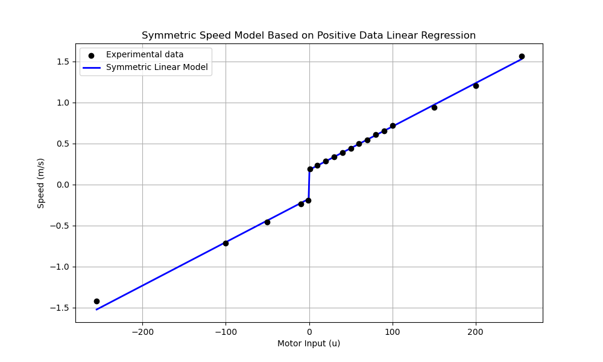

# 로봇 모터 속도 변환 모델

이 Repository는 로봇의 모터 입력값(-255 ~ 255)과 실험 데이터를 기반으로 한 속도 변환 과정을 기록합니다.  
실험에서는 로봇이 2m를 이동하는 데 걸리는 시간을 측정하였으며, 속도는 단순히 아래 식에 따라 계산되었습니다.

$$
v = \frac{2}{\text{time}}
$$

## 모델 개요

실험 데이터는 양수와 음수 입력에 대해 각각 측정되었으며, 속도 역시 부호를 반영합니다.  
양수 데이터를 사용하여 선형 회귀 분석을 수행한 결과, 다음과 같은 1차 선형 회귀식을 얻었습니다.

$$
v(u) = a \cdot u + b \quad \text{(for } u > 0\text{)}
$$

이를 이용하여, 모든 입력값에 대해 아래와 같이 점대칭 모델을 정의하였습니다.

$$
v(u) = \operatorname{sign}(u) \times (a \cdot |u| + b)
$$

여기서  
- $a$와 $b$는 양수 데이터에 기반하여 구한 선형 회귀 계수입니다.
- $\operatorname{sign}(u)$는 $u$의 부호 함수로, 음수 입력에 대해 속도를 음수로 반영합니다.

## 데이터 및 코드 구성

- **실험 데이터:**  
  - **양수 데이터:** $ u > 0 $인 경우의 모터 입력 및 측정된 속도 $(v = 2/\text{time}$)
  - **음수 데이터:** $ u < 0 $인 경우의 모터 입력 및 측정된 속도 (부호 반영)

실험 데이터
| 값    | 2m 이동 시간 (s) |
|-------|------------------|
| 1     | 10.78            |
| 10    | 8.56             |
| 20    | 7.05             |
| 30    | 5.93             |
| 40    | 5.21             |
| 50    | 4.56             |
| 60    | 4.04             |
| 70    | 3.70             |
| 80    | 3.31             |
| 90    | 3.06             |
| 100   | 2.80             |
| 150   | 2.14             |
| 200   | 1.66             |
| 255   | 1.28             |
| -1    | 10.45            |
| -10   | 8.30             |
| -50   | 4.37             |
| -100  | 2.79             |
| -255  | 1.41             |

## 결과 및 그래프

아래 그래프는 모터 입력값에 따른 실험 데이터와, 선형 회귀 분석으로 도출된 점대칭 모델을 보여줍니다.  
(모든 실험 데이터는 하나의 그래프로 함께 표시됩니다.)

## 결론

본 분석을 통해, 양수 데이터를 기반으로 한 선형 회귀 결과로 도출된 계수 $a$와 $b$를 이용하여  
모터 입력값 $u$에 대해 점대칭 모델 $ v(u) = \operatorname{sign}(u) \times (a \cdot |u| + b) $를 정의하였습니다.  
이를 통해 음수 및 양수 입력 모두에 대해 일관된 방식으로 로봇의 속도가 결정됨을 확인할 수 있습니다.  
이때, 각각의 값은 다음과 같습니다.
- $a = 0.00529$  
- $b = 0.17530$  
해당 계수에서 오차(RMSE)는 0.01625 입니다.
