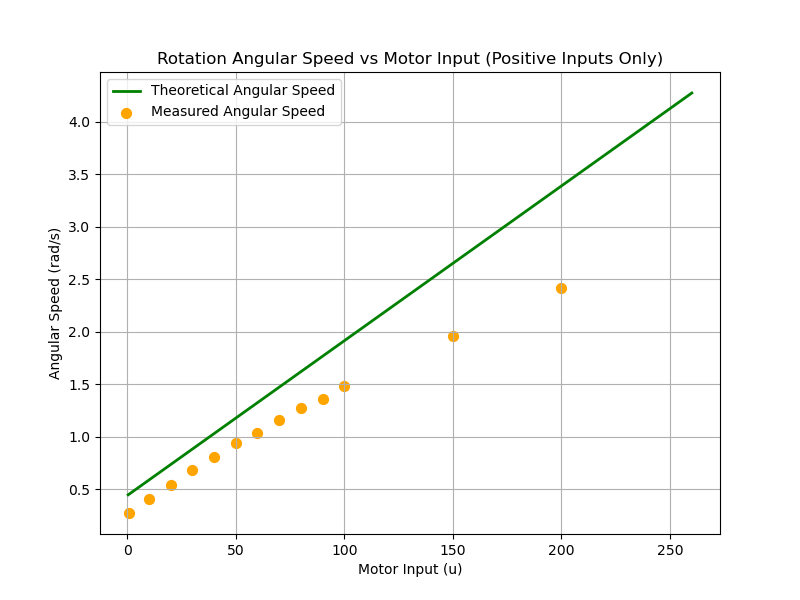

# 최적화 기반 로봇 속도 및 회전 모델

이 Repository는 로봇의 모터 입력값에 따른 선속도와 각속도 모델을 이론적으로 분석하고, 실험 데이터를 기반으로 최적화한 결과를 기록합니다.  
본 분석에서는 로봇의 직진 운동과 회전 운동에 대해 각각 2m 이동 시간과 1바퀴 회전 시간을 측정한 데이터를 활용하며, 이를 통해 선형 모델의 계수 $a$와 $b$를 결정합니다.  
특히, 로봇의 가로 길이(바퀴 사이 거리)를 **60cm (0.60 m)**로 고정한 상태에서 최적화를 진행합니다.

## 1. 모델 개요

### 1.1 선형 속도 모델
모터 입력값 $u$에 대해, 로봇의 선형 속도는 다음과 같은 1차식으로 가정합니다.

$$
v = a\,|u| + b
$$

- $|u|$는 모터 입력값의 절대값을 의미하며, 음수 입력의 경우에도 동일한 속도 크기를 가지지만 방향은 반대입니다.
- $a$와 $b$는 실험 데이터를 기반으로 최적화할 선형 계수입니다.

### 1.2 직진 운동 모델
양쪽에 동일한 모터 입력 $u$를 주어 로봇이 직진할 때, 측정된 2m 이동 시간으로부터 로봇의 선형 속도를 유도할 수 있습니다.  
실제 이동 시간 $T_{\text{straight}}$는 속도 $v$에 따라 다음과 같이 예측됩니다.

$$
T_{\text{straight}} = \frac{2}{v} = \frac{2}{a\,|u|+b}
$$

### 1.3 회전 운동 모델
좌우 모터에 부호가 반대인 입력, 즉 $u$와 $-u$를 주면 로봇은 제자리에서 회전하게 됩니다.  
이때, 한쪽 바퀴의 속도는 $v$이고 다른 쪽은 $-v$가 되어 바퀴 간 속도 차이는 $2v$가 됩니다.  
로봇의 회전 각속도 $\omega$는 두 바퀴 사이의 거리를 $L$이라고 할 때 다음과 같이 계산됩니다.

$$
\omega = \frac{2v}{L} = \frac{2(a\,|u|+b)}{L}
$$

한 바퀴 회전(360° 또는 $2\pi$ rad)을 완료하는 데 걸리는 시간 $T_{\text{rot}}$는

$$
T_{\text{rot}} = \frac{2\pi}{\omega} = \frac{\pi\,L}{a\,|u|+b}
$$

입니다.

> **주의:**  
> 위 모델에서 $L$은 로봇의 바퀴 사이 거리로, 본 분석에서는 $L=0.60$ m로 고정하였습니다.

## 2. 실험 데이터

### 2.1 직진 시 2m 이동 시간 데이터
아래 표는 모터 입력값 $u$에 대해 로봇이 2m를 이동하는 데 걸린 시간을 나타냅니다. (음수 입력의 경우에도 절대값으로 처리하여 회귀에 사용)

| Motor Input (u) | 2m 이동 시간 (s) |
|-----------------|------------------|
| 1               | 10.78            |
| 10              | 8.56             |
| 20              | 7.05             |
| 30              | 5.93             |
| 40              | 5.21             |
| 50              | 4.56             |
| 60              | 4.04             |
| 70              | 3.70             |
| 80              | 3.31             |
| 90              | 3.06             |
| 100             | 2.80             |
| 150             | 2.14             |
| 200             | 1.66             |
| 255             | 1.28             |
| -1              | 10.45            |
| -10             | 8.30             |
| -50             | 4.37             |
| -100            | 2.79             |
| -255            | 1.41             |

### 2.2 회전 시 1바퀴 회전 시간 데이터
아래 표는 좌우에 부호가 반대인 동일 입력값을 넣었을 때, 로봇이 한 바퀴 회전하는 데 걸린 시간을 나타냅니다.

| Motor Input (u) | 1바퀴 회전 시간 (s) |
|-----------------|---------------------|
| 1               | 23.17               |
| 10              | 15.64               |
| 20              | 11.61               |
| 30              | 9.22                |
| 40              | 7.77                |
| 50              | 6.70                |
| 60              | 6.07                |
| 70              | 5.41                |
| 80              | 4.95                |
| 90              | 4.63                |
| 100             | 4.23                |
| 150             | 3.20                |
| 200             | 2.60                |

## 3. 최적화 문제 및 방법

직진 시와 회전 시의 실험 데이터를 동시에 만족시키기 위해, 모델 예측값과 실제 측정값 간의 오차를 최소화하는 문제로 접근합니다.  
최적화 변수는 $a$와 $b$이며, 로봇의 가로 길이(바퀴 사이 거리) $L$은 **0.60 m**로 고정합니다.

### 3.1 잔차 정의
- **직진 시 잔차**  
  측정된 2m 이동 시간과 예측된 2m 이동 시간의 차이를 잔차로 정의합니다.

  $$
  \Delta T_{\text{straight}} = \frac{2}{a\,|u|+b} - T_{\text{straight}}^{\text{measured}}
  $$

- **회전 시 잔차**  
  측정된 1바퀴 회전 시간과 예측된 1바퀴 회전 시간의 차이를 잔차로 정의합니다.

  $$
  \Delta T_{\text{rot}} = \frac{\pi \times L}{a\,|u|+b} - T_{\text{rot}}^{\text{measured}}
  $$

두 데이터셋의 잔차를 하나의 벡터로 결합한 후, 이 잔차의 제곱합을 최소화하는 방식으로 최적의 $a$와 $b$를 찾습니다.

## 4. 결과 및 결론

최적화 과정을 통해 도출된 계수 $a$와 $b$는, 주어진 실험 데이터를 가장 잘 설명하는 모델을 제공합니다.  
이 모델을 통해 예측할 수 있는 결과는 다음과 같습니다.

- **직진 운동 예측**

  $$
  T_{\text{straight}} = \frac{2}{a\,|u|+b}
  $$

- **회전 운동 예측 (고정 $L=0.60$ m)**

  $$
  T_{\text{rot}} = \frac{\pi \times 0.60}{a\,|u|+b}
  $$

이론적으로, 해당 모델은 로봇의 모터 입력값에 따른 선속도와 각속도를 예측할 수 있으며, 이를 통해 로봇의 주행 및 회전 동작을 정밀하게 제어할 수 있습니다.  
  
결론적으로 우리의 계수는 다음과 같습니다.
$$
a = 0.00443 \\
b = 0.13113
$$

해당 계수에 대해서 이론 값과 실제 실험 데이터의 그래프는 다음과 같습니다.

- **직선 운동 예측**
    

- **회전 운동 예측**
    

